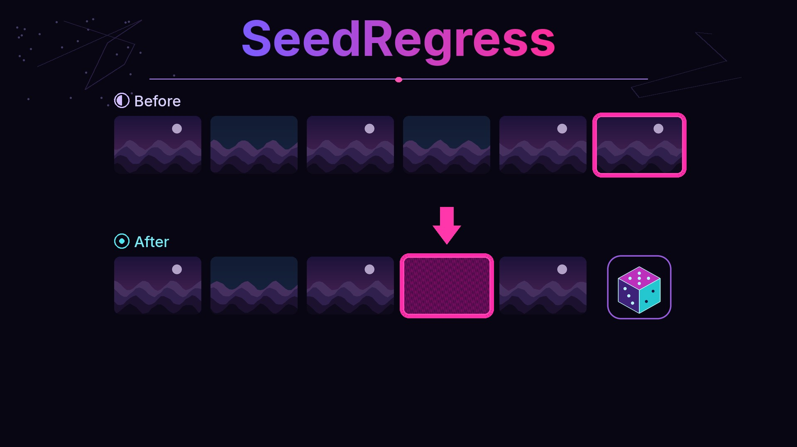

# SeedRegress

Visual regression tests for a ComfyUI pipeline. You keep a suite of prompts and seeds, render them through ComfyUI, and later re-render the same cases to see whether a LoRA or checkpoint drifted.

## Quick start

1. Download or clone this repository.
2. Double-click the launcher:
   - macOS: `Launch SeedRegress.command`
   - Windows: `Launch SeedRegress.bat`
   - Linux: `./launch.sh`, or open `seedregress.desktop`

The first launch creates a `.venv`, installs the pinned packages in `requirements.txt`, and opens the app in your browser. Later launches skip the install and start straight away.

Python 3.11 or newer is required. If Python is missing or too old, the launcher stops and points you to [python.org/downloads](https://www.python.org/downloads/).

3. In the app, set the ComfyUI host. An example on a home network is `192.168.4.47:8188`. That address is only an example. It is not built in, and the app will not contact a machine until you type one.
4. The example suite loads as a dry-run: planned jobs, a rough time estimate, and a note that the queue has not been checked yet.
5. When the family PC is free for a render, check **I confirm this run may use the GPU** and press **Run on GPU**.

There is no scheduler. SeedRegress never queues work by itself.

## What a run does

A suite is one ComfyUI API-format workflow plus a list of cases. Each case has a positive prompt, a negative prompt, a seed, steps, a sampler, a size, and any LoRA names and weights.

A confirmed run:

1. Calls `GET /system_stats` and `GET /queue`.
2. Refuses if anything is running or pending. It does not append to a busy queue.
3. Submits each case with `POST /prompt`, watches the websocket when ComfyUI accepts one, and polls `GET /history/{prompt_id}`.
4. Downloads the image with `GET /view`.
5. Saves a baseline the first time a case is rendered. Later runs compare against that baseline.

**Cancel all my jobs** calls `POST /interrupt` only when the running job belongs to this install, then `POST /queue` with `delete` set to this install's pending prompt ids. It never sends `clear`, so other people's jobs stay queued.

## Scores

| Metric | Role |
| --- | --- |
| pHash distance | Hamming distance of a 64-bit perceptual hash. Lower is closer. |
| SSIM | Structural similarity, 1.0 is identical. |
| Diff heatmap | Per-pixel absolute difference, colored for the report. |
| LPIPS | Optional, off unless you install it and turn it on. |

Default thresholds, overridable in the suite file:

- pass when pHash ≤ 6 and SSIM ≥ 0.98
- fail when pHash ≥ 16 or SSIM ≤ 0.90, or the image size changed
- drift when the numbers land between those bounds

The report and the web UI show before, after, and diff side by side. Each baseline also stores the ComfyUI version from `/system_stats`, plus SHA-256 hashes of the checkpoint and LoRA files when you set a models folder. A remote ComfyUI box does not upload its model files. Point **Models folder** at a directory this computer can read (a share or a local ComfyUI `models` tree). If you leave it empty, the report still records filenames and the ComfyUI version.

## Suite file

`examples/still-life.suite.json` is a safe-for-work example: a mountain valley, a ceramic bowl, and three geometric solids. Copy it and edit the prompts. `comfy_host` may be set per suite, or left empty so the app setting is used.

```json
{
  "name": "Still landscapes and objects",
  "workflow": "workflows/txt2img_api.json",
  "seconds_per_step": 0.4,
  "enable_lpips": false,
  "bindings": {
    "positive": "6",
    "negative": "7",
    "sampler": "3",
    "latent": "5",
    "checkpoint": "4",
    "lora": "10"
  },
  "cases": []
}
```

`bindings` are node ids in the API-format workflow. A case with an empty `loras` list bypasses the LoRA loader so ComfyUI is not asked to load a file. Several LoRAs are chained by cloning that loader.

The time estimate is `steps × seconds_per_step`, plus about two seconds per LoRA. It is a planning hint, not a measurement from the GPU.

## Command line

Dry-run (no network):

```bash
python -m seedregress plan examples/still-life.suite.json
python -m seedregress run examples/still-life.suite.json
```

Actually render:

```bash
python -m seedregress run examples/still-life.suite.json --confirm-gpu --host 192.168.4.47:8188
```

Update baselines after the comparison:

```bash
python -m seedregress run examples/still-life.suite.json --confirm-gpu --update-baseline
```

Cancel this install's jobs:

```bash
python -m seedregress cancel --confirm-gpu
```

Exit codes for `run`: `0` dry-run, baselines, or all pass; `2` drift; `3` fail or error; `4` refused (busy queue, missing host, or LPIPS requested but not installed).

The web UI is `python -m seedregress serve`. It binds to `127.0.0.1` on a free port and opens your browser. Config, baselines, and reports go in `./data`, which is gitignored. Override the folder with `--data-dir` or `SEEDREGRESS_DATA`.

## Dev setup

```bash
python3 -m venv .venv
source .venv/bin/activate
python -m pip install -r requirements-dev.txt
ruff check .
pytest
```

On Windows, activate `.venv\Scripts\activate` instead.

## Tests

`pytest` covers:

- a mock ComfyUI server for prompt submission, history polling, and image fetch
- pHash, SSIM, and the heatmap on synthetic images
- pass, drift, and fail thresholds
- the confirm-gpu gate (no ComfyUI call without it, on the CLI and the web API)
- refusal when the queue is busy, before any prompt is posted
- cancel deleting only this install's jobs
- HTML report generation
- launcher scripts and a loopback smoke test that expects HTTP 200

## Optional LPIPS

LPIPS is off by default and is not installed by the launcher.

```bash
python -m pip install -r requirements-lpips.txt
```

Then set `"enable_lpips": true` on the suite. Thresholds are `lpips_pass_max` (default 0.08) and `lpips_fail_min` (default 0.25). If the suite asks for LPIPS and the package is missing, a confirmed run stops before it contacts ComfyUI.

## Optional packaged build

`scripts/build_app.py` wraps the app with PyInstaller. Run it on the OS you want the binary for, after `pip install pyinstaller`:

- macOS: `dist/SeedRegress.app` using `assets/icon.icns`
- Windows: `dist/SeedRegress.exe` using `assets/icon.ico`
- Linux: a `dist/SeedRegress` folder

`python scripts/build_app.py --dry-run` prints the command and does not build. CI runs the tests and does not run PyInstaller.

## Privacy

SeedRegress is a local app. The web UI listens on `127.0.0.1` only. There is no account, no cloud service, and no telemetry. Renders, reports, and `data/config.json` stay on this computer. Example prompts are landscapes, objects, and shapes. The git history does not include generated images; tests draw synthetic fixtures in memory. `/system_stats` is reduced to the ComfyUI, Python, and PyTorch versions plus device names. Process arguments from that payload are not stored.

## Limitations

- The macOS `.command` launcher and the Windows `.bat` launcher were not executed on those operating systems here. On Linux, `bash -n` checked the shell scripts, and pytest started the server on `127.0.0.1`.
- PyInstaller was not run. The build script's `--dry-run` was.
- LPIPS was not installed in the test environment. The suite flag defaults to off, and a missing install is refused before any GPU call.
- Tests use a mock ComfyUI. They do not drive a real GPU or a real ComfyUI process. The websocket handshake is tested against a local socket; image bytes come from `GET /history` and `GET /view`.
- A busy queue means any running or pending job, including ones left by another program. Cancel will not remove those.
- File hashes need `models_root` on a folder this computer can read. Otherwise the report keeps the checkpoint and LoRA names and the ComfyUI version.
- The first confirmed render of a case saves a baseline and does not score it.
- The cover and the die icon are a redraw of the project artwork (purple and pink palette, isometric die). They are not a byte-for-byte crop of a source photo.
- The time estimate is steps times a configurable seconds-per-step. ComfyUI does not return a duration ahead of the render.
